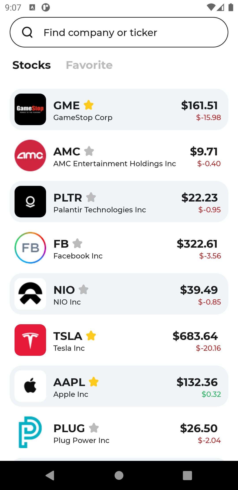
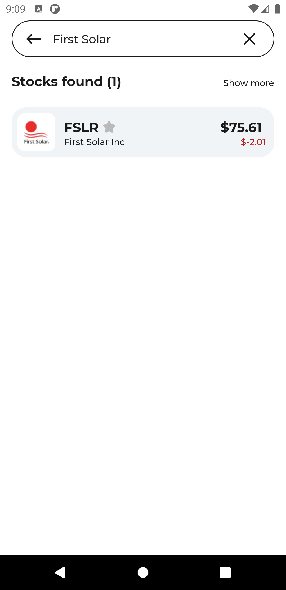

# YandexEntranceProject
Проектная часть вступительного испытания для Школы мобильной разработки

### Скриншоты
 
 
 

### Реализовано
* Отображение списка акций на экране
* Отображение цен акций в режиме реального времени
* Возможность добавлять акции в "Избарнное"
* Возможность искать акции по тикеру или названию компании, а также добавлять их "Избранное"

## Архитектура приложения и инструменты
### Хранение данных
* Для работы с локальной базой данных использовалась библиотека Room
* Любые загруженные данные сохраняются в локальную базу данных

### Работа с сетью
* Для работы с сетью использовалась бибилиотека Retrofit, с Gson ковертером
* Для загрузки логотипов библиотека Glide
* Для получения данных об акциях использовался Finnhub API
* Для получения трендовых тикеров Mboum API
* Для получения данных о ценах акций в режиме реального времени использовался OkHttp WebSoket
* Для обращений к сети используется алгоритм NetworkBoundResource, упрощённый с использованием лямбд и Flow

### UI
* Для UI используется метод Single Activity, с отдельными Fragment'ами для экранов, с собственными Toolbar'ами
* UI реагирует на любое изменение в базе данных и подгружает самые свежие данные

### Описание решений
* Код написан на Kotlin
* Архитектура MVVM
* Для инъекций зависимостей используется Hilt
* Для асинхронных операций используются Coroutines и Flow
